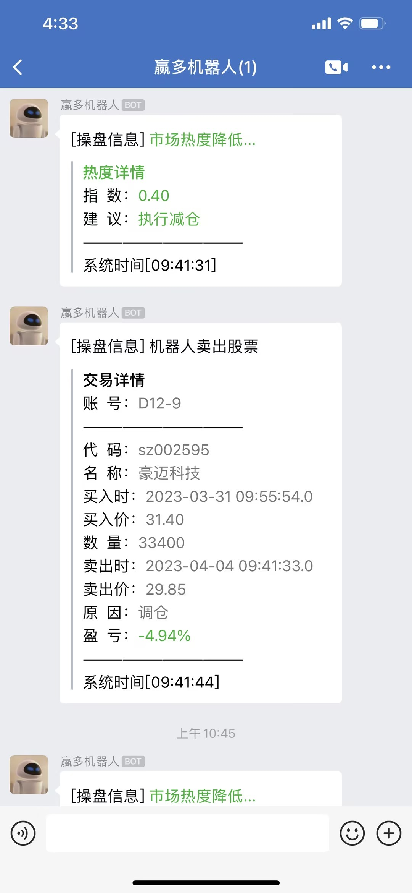

# WinDog（赢多）

#### 系统介绍
赢多交易系统————股票量化机器人交易系统。
目前已经实现：多策略自动选股，自动控制仓位，自动完成买卖交易，自动计算盈利情况。并根据执行不同选股策略的机器人表现进行优选，找到当前最有效的策略，为用户自己操盘提供参考。机器人实时操盘指令，可通过企业微信推送到群，方便用户及时了解市场行情。

#### 交易痛点

1. 验证失真：交易者为了验证选股策略有效性，往往会自己写一些公式，然后在股票行情系统中进行日线级别的模拟验证，日线数据验证的结果往往不具有参考性。
2. 仓位失控：影响市场热度的因素有很多，仓位的控制必须以变应变，大多数交易者用恒定的止盈止损策略操盘，必然不具备科学性。
3. 以慢对快：交易过程中快速发现标的物，快速完成买卖交易能提高交易获利的概率。绝大多数上班族投资者没有足够的时间看盘，往往是市场里游得最慢的鱼。
4. 工具代差：生产工具的代差，是散户和机构无力对抗的鸿沟。散户的单机 VS 机构的AI+云计算+集群，这种不对称的博弈差距越拉越大。
5. 有限试错：机器学习的平台可以释放成千上万个策略组合，可以在混沌无序的万千事物中，找到那只影响市场的手，对于散户而言，试错的成本巨大且不可控。
6. 知识匮乏：交易者通常缺乏足够的专业知识，也没有获取金融领域重要信息的管道，不具备高质量的分析能力。部分投资者了解的股票不超过100支。

#### 赢多目标

1. 面向用户免费推出股票量化交易系统，帮助用户构建属于自己的交易系统；
2. 支持用户自主开发选股策略，为用户提供实盘环境下的策略验证；
3. 支持用户释放成千上万个策略组合，完成策略选优；
4. 支持更多的开发者加入进来，让赢多更优化，更智能；

#### 软件架构
软件截图

|  |   |
|---|---|
|  |   |

#### 行情数据
实时行情通过腾讯接口获取，如：
https://qt.gtimg.cn/q=sh600031

历史行情数据及行业分类等从tushare获取，请用户自行申请访问token
https://tushare.pro/

#### 安装教程

1.  安装MySQL数据库，版本5.6以上即可，创建yunbo数据库，导入数据库脚本；
2.  安装jdk1.8（或者jre1.8）及以上版本，配置好JAVA_HOME环境变量；
3.  安装python3.9及以上版本，安装如下所需的包。
4.  可选安装redis5。

#### 使用说明

1.  在IDEA中启动项目后，打开浏览器访问：https://localhost:8008/。
2.  缺省的登录账号：admin，缺省密码：admin。
3.  正常运行后，在股市开盘时间，系统会自动操盘，完成行情实时采集、策略选股、账户止盈止损等操作，无需人为干预，已经打通企业微信实时消息通知。

#### 重要声明！！！

1.  用户可以研究和学习、使用、改进本系统。
2.  本系统以实时行情数据模拟，通过虚拟操作实现虚拟账户利益最大化。
3.  本系统所有策略和交易均作为学习及验证使用，不构成任何投资建议，不为用户的任何投资行为承担责任。

